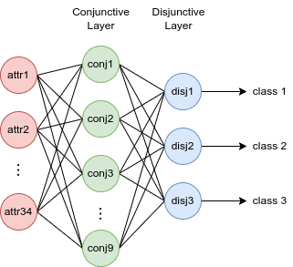
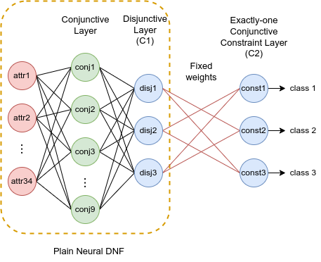

# Neuro-symbolic Rule Learning with Neural DNF-based Models in CUB dataset/subsets

This repository contains the source code for multi-class classification
experiments in CUB[1] dataset/subsets, accompanied the paper
"Neuro-symbolic Rule Learning in Real-world Classification Tasks".
Our neural DNF-based models are built upon
[pix2rule](https://github.com/nuric/pix2rule)[2]'s semi-symbolic layers.

Check out sibling repo: [Neuro-symbolic rule learning with neural DNF
models in TMC dataset/subsets](https://github.com/kittykg/neural-dnf-tmc)

## Project structure

**Directories**

* `conf/`: contains hydra config for running experiments.

* `scripts/`: some useful bash scripts for running data pre-processing and
generating FastLAS[3] examples. The scripts rely their corresponding python
scripts described below.

* `synthetic_test`: contains the synthetic binary and multi-class classification
tasks, as well as a unit test for our implementation of semi-symbolic layers.

**Modules**

* `analysis.py`: contains various `Meter` classes for different metrics.

* `common.py`, `dataset.py`, and `utils.py`: common reusable classes/functions
for experiments.

* `dnf_layer.py`: implementation of pix2rule's semi-symbolic layer.

* `dnf_post_train.py`: post-training processes for symbolic rule
extraction.

* `eval.py`: evaluation methods for neural DNF-EO and ASP rules.

* `rule_learner.py`: the full neural DNF-EO model.

* `train.py`: contains the base `Trainer` class for training a neural DNF-based
model.

**Python scripts**

* `data_preprocess.py`: data pre-processing script for CUB dataset, also used
for generating subsets. We follow the same pre-processing used in [Concept Bottleneck Models paper](https://github.com/yewsiang/ConceptBottleneck) [4].

* `las_gen.py`: script for generating FastLAS learning example and mode biases.

* `full_pipeline_dnf.py`: full pipeline of training a neural DNF-EO model and
post-training processing.

* `mlp_baseline.py`: full pipeline of training and evaluation of MLP.

* `run_train.py`: training process of a neural DNF-EO model.

## Models

Our neural DNF-based models are created with pix2rule's semi-symbolic layers.

The **vanilla neural DNF model** is identical to pix2rule, but does not enforce
mutual exclusivity (i.e. predicting exactly one class at a time).

One of our contributions in the paper is the **neural DNF-EO model**
(in `rule_learner.py`), which enforces mutual exclusivity with the constraint
layer. The constraint layer mimics the logic formula
$class_i \leftarrow \wedge_{j, j\neq i}\ class_j$
which states that a class can only be true if all other classes are not true.
This constraint layer is not trainable, and at inference time we remove it and
only use the plain neural DNF to make predictions.

## Requirements

**Base python**: version >= 3.10

**Dataset**: Caltech-UCSD Birds-200-2011 - download:
[link](https://drive.google.com/file/d/1hbzc_P1FuxMkcabkgn9ZKinBwW683j45/view)
(this link may not be working any more)

**Libraries**: 

* [Pytorch](https://pytorch.org/) version >= 1.12.0 - machine learning framework

    - [Torchvision](https://pytorch.org/vision/stable/index.html) - computer
      vision library. Not used for the rule learning from CUB attributes, but
      left in the code for potential end-to-end learning from CUB images.

* [Hydra](https://hydra.cc/) version >= 1.2 - config management framework

* [Clingo](https://potassco.org/clingo/) - ASP solver

* [scikit-learn](https://scikit-learn.org/stable/index.html) - metrics &
decision tree

## Running instructions

TODO

## References

[1] [Catherine Wah et al., The Caltech-UCSD Birds-200-2011 Dataset](https://authors.library.caltech.edu/27452/)

[2] [Nuri Cingillioglu et al., pix2rule: End-to-end Neuro-symbolic Rule Learning.](https://arxiv.org/abs/2106.07487)

[3] [Mark Law et al., FastLAS: Scalable Inductive Logic Programming Incorporating Domain-Specific Optimisation Criteria](https://ojs.aaai.org/index.php/AAAI/article/view/5678)

[4] [Pang Wei Koh, Thao Nguyen, Yew Siang Tang et al., Concept Bottleneck Models](http://proceedings.mlr.press/v119/koh20a.html)
